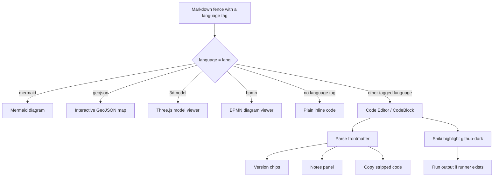
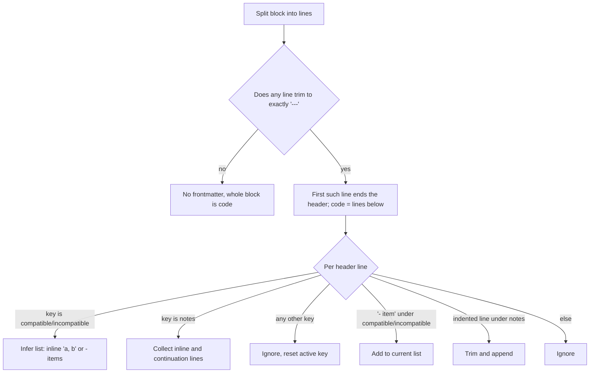

# Code Editor

Every fenced code block in a Note Haven note — anything you write between triple backticks with a language tag like `json`, `python`, `ts`, or `js` — is rendered by the **Code Editor**. It gives your code syntax highlighting, a small header bar with copy/run actions, and an optional frontmatter header that can show version badges and a collapsible notes panel. JavaScript and `js` fences are even *runnable* right in the note, executing inside a sandbox and showing the captured output below the block.

This page explains each piece, shows the frontmatter options you can use, and walks through enough examples that you can start writing rich code blocks without reading any app source.


> The rendered code block with its header bar, version chips, and run output.

---

## What a code block looks like

A code block renders as:

1. **A header bar** — the language label (e.g. `python`), any version chips, and buttons for **Notes**, **Run**, and **Copy**.
2. **The highlighted code** — tokenized with Shiki (the `github-dark` theme) so it is color-coded.
3. **Optional output** — appears below the block when you click **Run**.

```
┌──────────────────────────────────────────────┐
│ python    ✓ 3.6            Notes  Run  Copy  │
├──────────────────────────────────────────────┤
│ print("hello")                               │
│                                              │
│ ▸ hello                                      │  ← run output (green)
└──────────────────────────────────────────────┘
```

The buttons adapt to the block's content:

- **Notes** — appears only when the block has frontmatter `notes`.
- **Run** — appears only when the app has a runner for the block's language (see [Running code](#running-code)).
- **Copy** — always present; copies the *code only* (frontmatter is stripped).

---

## Frontmatter

Each code block can carry an optional header before the actual code. The header is a small, YAML-like block that starts on the first line and ends at the first line that contains exactly `---`. Everything after that marker is treated as the real code.

```
notes: Uses the legacy mapping API
---
print("hello")
```

Here `notes: Uses the legacy mapping API` is the frontmatter (no terminating `---` needed yet) and `print("hello")` is the code. The frontmatter is **not** highlighted and is **not** copied when you hit Copy — only the code after the `---` line is.

If a code block has no `---` line at all, it is treated as plain code with no frontmatter.

### Supported options

| Option | Type | Values | Where shown | Default |
| ------ | ---- | ------ | ----------- | ------- |
| `compatible` | list of strings | Inline (`compatible: 2.7, 3.6`) or block (`- 2.7` per line) | Green chip in header: `✓ 2.7` | none |
| `incompatible` | list of strings | Inline (`incompatible: 1.0`) or block (`- 1.0` per line) | Red chip in header: `✗ 1.0` | none |
| `notes` | string | Inline or multi-line block | Amber "Notes" panel, toggled by the Notes button | none |

Option names are **case-insensitive** (`compatible`, `Compatible`, `COMPATIBLE` all work). Unknown keys are ignored. A `---` line inside the `notes` text would terminate the frontmatter early, so avoid that.

### Lists

Both `compatible` and `incompatible` accept a comma-separated inline list on one line, or a block list with each version on its own indented `- ` line (either style works and you can mix them across options):

```
compatible: 2.7, 3.6
incompatible:
  - 1.0
  - 3.10
---
print("hello")
```

Renders version chips `✓ 2.7`, `✓ 3.6` (green) and `✗ 1.0`, `✗ 3.10` (red). Use these to show which tool/API versions a snippet is known to work with.

### Notes

`notes` is a free-form string. One line inline, or a block of continuation lines (each indented; the leading whitespace is trimmed):

```
notes: First line
  continued here
---
const x = 1;
```

Both render as a single amber panel that appears when you click **Notes**. The block-list form is handy for longer explanations:

```
notes:
  This uses a legacy API.
  Prefer the new client, which is available from 3.6.
---
from collections import Mapping
```

---

## Examples

**Compatible only**

````markdown
```python
compatible: 3.9, 3.10, 3.11
---
def add(a, b):
    return a + b
```
````

**Incompatible only**

````markdown
```python
incompatible: 3.6
---
async = 5   # 'async' is a keyword in 3.7+
```
````

**Both, block lists**

````markdown
```python
compatible:
  - 2.7
  - 3.6
incompatible:
  - 1.0
---
print("legacy path")
```
````

**Notes inline**

````markdown
```ts
notes: Requires TypeScript 4.5+ for 'satisfies'
---
const config = { port: 8080 } satisfies Record<string, unknown>;
```
````

**Notes, multi-line block**

````markdown
```json
notes:
  This endpoint was deprecated.
  Remove this sample once the migration lands.
---
{ "url": "/api/v1/users" }
```
````

**All options combined**

````markdown
```python
compatible: 3.6, 3.9
incompatible: 2.7
notes:
  Uses the legacy mapping API.
  Port to collections.abc when on 3.9+.
---
from collections import Mapping
```
````

**A runnable JS example** (shows `[log]` output plus the returned value)

````markdown
```js
compatible: ES2020
notes: Sums an array using reduce.
---
const nums = [1, 2, 3];
console.log("sum:", nums.reduce((a, b) => a + b, 0));
return nums.map((n) => n * 10);
```
````

---

## Running code

When a runner exists for a block's language, a **Run** button appears in the header. Clicking it executes the code (frontmatter stripped) and shows the captured output below the block in a green panel prefixed `▸`. Errors render in red prefixed `✗`.

Built-in runners:

| Language tag | Runnable? |
| ------------ | --------- |
| `js`, `javascript` | Yes — sandboxed JS |
| every other tag | No (unless a developer registers a runner) |

So by default only ` ```js ` and ` ```javascript ` fences get a Run button.

- Clicking **Run** disables the button and shows **Running…** until the runner settles.
- If the runner resolves with an empty result, the block shows `(no output)`.
- A thrown error appears prefixed `✗` in a red panel.

### The JavaScript sandbox

When you run a `js` block, the code executes in a restricted sandbox rather than your page. It runs as an async function body, so top-level `await` works and you can `return` a value.

**Console output is captured**, prefixed by channel:

| Call | Output prefix |
| ---- | ------------- |
| `console.log(...)` | `[log]: ` |
| `console.info(...)` | `[log] ℹ: ` |
| `console.warn(...)` | `[log] ⚠: ` |
| `console.error(...)` | `[log] ✗: ` |

Anything you `return` (and it is not `undefined`) is appended to the output too.

**Value formatting:**

- Strings print as-is.
- Objects are pretty-printed with `JSON.stringify(_, null, 2)`.
- If an object is circular, it falls back to `String(value)` — typically `[object Object]` (a circular *array* may print as an empty string).
- `null` and `undefined` are printed as `null` and `undefined`.

**Globals that are blocked** produce a message and do nothing else:

```
[blocked] <name>() is not available in sandbox
```

The blocked list covers `alert`, `confirm`, `prompt`, `open` / `window.open`, `fetch`, `XMLHttpRequest`, `eval`, `Function`, and `setInterval`.

**`setTimeout` is allowed, but capped:** a delay above 5 seconds is rejected with `[blocked] setTimeout with delay > 5s` and the callback never fires. Exactly 5 s is fine.

**Available globals** include the standard JS toolbox: `Math`, `Date`, `JSON`, `parseInt`, `parseFloat`, `isNaN`, `isFinite`, `Number`, `String`, `Boolean`, `Array`, `Object`, `Map`, `Set`, `RegExp`, `Error`, `Promise`, and `Symbol`. Syntax errors and runtime exceptions make the run fail and show as a red `✗` output.

```js
// Runnable sandbox example
const total = [1, 2, 3].reduce((a, b) => a + b, 0);
console.log("total:", total);
await new Promise((r) => setTimeout(r, 100));   // allowed (≤ 5000ms)
console.log("after a 100ms pause");
return { total, doubled: total * 2 };           // pretty-printed JSON
```
```
[log]: total: 6
[log]: after a 100ms pause
{
  "total": 6,
  "doubled": 12
}
```

---

## How a fence is routed

Not every fenced block becomes a Code Editor block. Note Haven reserves some language tags for special interactive viewers, and anything else becomes a regular code block.



The frontmatter parsing decision tree, in short:



There is no `---` *closing* marker required for the frontmatter itself — the *first* `---` line always ends the header. The code then runs through Shiki, where an unknown or failing grammar automatically falls back to plain-text highlighting (the `text` grammar) so the block never looks broken.

---

## Good to know

- **Loading state:** while Shiki loads, a plain `<pre>` placeholder on a dark background shows the raw code; it is replaced the moment highlighting resolves.
- **Fallback highlight:** if Shiki doesn't know the requested grammar (or it throws), it highlights the block as plain text instead.
- **Copy target:** Copy always captures the frontmatter-stripped code. The button flashes **Copied** for about two seconds, then reverts to **Copy**.
- **Theme:** highlighting is fixed to the `github-dark` theme.

---

## Developer notes

The execution layer is a small, extensible registry in `src/lib/codeRunners.ts`:

- `registerRunner(language, fn)` — register an async runner `(code: string) => Promise<string>`.
- `unregisterRunner(language)` — remove a runner.
- `getRunner(language)` / `hasRunner(language)` — look up a runner.
- `listRunners()` — all registered languages.

Languages are stored lowercased, so lookups like `hasRunner('PYTHON')` and `hasRunner('python')` behave identically. A runner's `Promise` resolves to the output text shown in the green `▸` panel, or rejects to the red `✗` error panel (non-`Error` rejections are stringified).

Only the JS runner is registered by default — `registerJSRunner()` in `src/App.tsx` registers the sandboxed runner under both `javascript` and `js`. To add a runner for another language (say `python` or `bash`), call `registerRunner('python', myAsyncRunner)` at startup; a **Run** button then appears automatically on every Python fence. The registry is purely additive and requires no change to the `CodeBlock` component itself.
