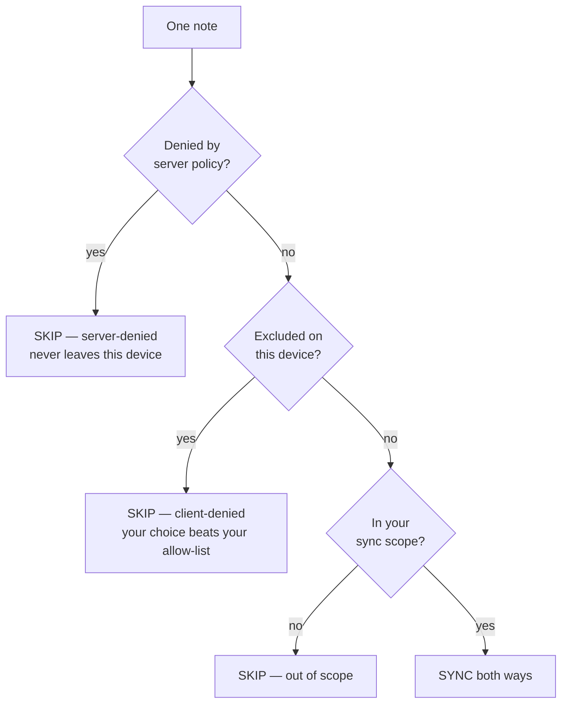

# Keeping notes off the server: sync exclusions

**Reading time:** ~4 min whole page; sections are labelled if you only need one.

Some notes are personal, secret, or just none of the server's business. Sync
exclusions let you keep them **on this device only** — the server never sees
them, and neither does any other device.

**The one rule to remember: deny always wins.** If anything anywhere says
"this note does not sync", it does not sync — no matter what any allow-list
says.

---

## Tutorial — keep private notes off the server in 2 minutes

*Start here if you just want a category to never sync.* (~2 min)

1. Open the app and tap **Settings** (gear icon).
2. Scroll to **What to sync**.
3. If it helps, first pick **Selected categories only** and tick the
   categories you *do* want — but you don't have to.
4. Under **Excluded from sync**, use the **"Exclude a category…"** dropdown
   and pick `Private`.
5. Press **Save** (or **Sync now** to see it take effect).

That's it. Notes in `Private` now stay on this device forever. In the note
list they show a small muted **excluded** badge. Nothing is deleted — the
notes are simply never uploaded or downloaded.

> You can also exclude a single note: hover it in the sidebar and click the
> cloud-off icon (title "Exclude from sync").

## How-to guides

### Exclude a category (~30 sec)

Settings → **What to sync** → **Excluded from sync** → pick the category
from the dropdown. Repeat for as many categories as you like. Each shows as
a chip with an **×** to undo.

### Exclude a single note (~30 sec)

In the note list (sidebar), find the note, hover to reveal the row actions,
and click the **cloud-off icon** ("Exclude from sync"). The note gains a
muted **excluded** badge. Click the icon again ("Include in sync") to undo.
If you excluded a note after a deletion prompt appeared, that prompt stays
and you can still resolve it; exclusion only prevents new prompts.

### Un-exclude (~15 sec)

- **A note:** click its cloud-off icon again in the sidebar.
- **A category:** Settings → **What to sync** → **Excluded from sync** →
  click the **×** on the category's chip.

The note starts syncing again at the next sync round — nothing is re-uploaded
from scratch; ordinary merging continues where it left off.

Excluding a note freezes its server copy at the pre-exclusion version —
other devices keep the old version until you un-exclude the note or the
server admin deletes it.

### What if my server admin denies a category? (read-only for you)

Some categories may be **denied by your server** — the settings page shows a
lock icon and "Denied by server policy" next to them, and they cannot be
selected for syncing. You don't configure this; if it seems wrong, contact
your server admin (see [server-admin.md](server-admin.md)).
## Explanation — why deny wins: the precedence model (~2 min)

Three layers decide whether a note syncs. They are checked in order, and the
**first denial wins** — a note only syncs when every layer says yes:

Why this shape? Each layer answers to a different authority:

- **Server deny** (admin): "this content must not exist on the server." It is
  checked first because the server is authoritative — even a client that
  disagrees is refused with `403 excluded` at upload time.
- **Client deny** (you, per device): your explicit "never this" — and it
  beats your own allow-list, because a denial you made deliberately should
  not be undone by a broader selection you made casually.
- **Sync scope** (you): the "All notes / Selected categories only" choice.

One honesty note about the **server deny** layer: the app reads the
server's policy from its discovery document at the start of each sync round,
and that read is **best-effort**. If the server (or just the discovery
endpoint) is unreachable or the policy cannot be read, the run proceeds with
an **empty deny list** — the server itself is the enforcement backstop and
still refuses an excluded upload with `403 excluded` at that moment. The
practical gap: a note that is already stored on the server (it was synced
before the policy was set) may be **pulled** that round, since nothing on
either side denies the download. The one deliberate exception to "the server
has the last word" is lifecycle bookkeeping: deleting a note locally always
propagates to the server, even for excluded notes, so your deletions are
never stranded.

What exclusions are *not*: a delete button. Nothing is ever removed from your
device by an exclusion — notes keep their sync identity, so un-excluding
later resumes cleanly.

## Reference — every knob

| Knob | Layer | Who controls it | Where it lives | What it does |
|---|---|---|---|---|
| `NOTEHAVEN_EXCLUDED_CATEGORIES` | server deny | sysadmin | server env | Categories the server refuses to store (`PUT` → 403) |
| `NOTEHAVEN_EXCLUDED_NOTES` | server deny | sysadmin | server env | Note uids the server refuses to store |
| `notes.excluded_categories` / `notes.excluded_uids` | — | — | discovery doc | Read-only advertisement of the above |
| **Selected categories only** | client allow | user | Settings → What to sync | Scope allow-list (`syncedCategories`) |
| **Excluded from sync** (categories) | client deny | user | Settings → What to sync | Per-device category deny-list (`excludedCategories`) |
| **Exclude from sync** (note) | client deny | user | Sidebar row action | Per-device note deny-list (`excludedNoteIds`) |
| **excluded** badge | — | — | Sidebar | Shows a note is on the device deny-list |
| 🔒 **Denied by server policy** | — | — | Settings | Server-denied category (cannot be allow-listed) |
| 🔒 **server-denied** badge | — | — | Sidebar | Note's category is denied by the server — shown but never synced |

Related: [sync.md](sync.md) — the sync protocol and merge semantics ·
[server-admin.md](server-admin.md) — running and configuring the server.