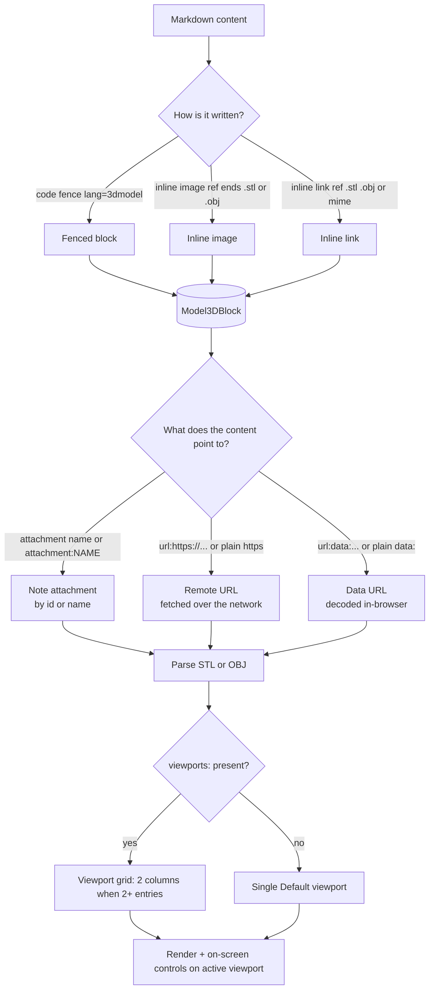

# 3D Model Viewer

Note Haven can render STL (`.stl`) and Wavefront OBJ (`.obj`) 3D models directly inside a note using Three.js — no external software needed. You drop a model into a note, and Note Haven shows it in an interactive viewer with a CAD-style look: a light-gray wireframe ground grid, adjustable camera angles, and per-viewport rendering controls.

Everything is configured in plain Markdown. You can either embed a model with the simplest possible reference (an attachment, a URL, or a data URL) and accept sensible defaults, or drive every detail through an optional frontmatter-style header: multiple viewports, camera angles, render modes, projections, coordinate systems, and textures.

This guide walks through how a model gets triggered, every option you can set, and worked examples for the common layouts.


---

## Quick start with a slash command

The fastest way to drop in a viewer is the in-app slash-command palette. Type `/` in the editor and choose **3D Model** (labelled "Render interactive STL or OBJ"). It inserts a ready-made, two-viewport template that demonstrates several options at once — an isometric Solid view plus an orthographic Top view in Wireframe:

````markdown
```3dmodel
---
viewports:
  - name: Isometric
    camera: [20, 20, 20]
    mode: Solid
  - name: Top View
    camera: [0, 30, 0]
    mode: Wireframe
    projection: orthographic
---
attachment:clip.stl
```
````

Just replace `clip.stl` with the name of your attached `.stl` (or `.obj`) file — for example `attachment:gearbox.stl` — and the viewer renders immediately. This template is also a handy reference for the option syntax used throughout this guide.

---

## How a model is triggered

There are three ways to tell Note Haven that a piece of Markdown is a 3D model:

1. **A fenced code block.** Wrap the model reference and any frontmatter in a ` ```3dmodel` code fence. This is the only route that supports frontmatter options (viewports, textures, camera angles, and so on).
2. **An inline image.** `` where the target name ends in `.stl` or `.obj` (case-insensitive).
3. **An inline link.** `[text](target)` where the target ends in `.stl` / `.obj`, or contains the substrings `model/stl`, `model/obj`, or `application/octet-stream`.

For the inline image and link routes, the "content" that gets loaded is simply the target itself — no frontmatter is assumed.



> **Note on the image/fence detection detail:** the fenced `3dmodel` block always routes to the viewer and passes an empty language string, while the inline image and link routes pass `stl` or `obj` based on what the target name ends with.

---

## What the content points to

After the frontmatter (if any) is stripped, the remaining `content` identifies the model source. It can be one of:

- **A note attachment** — a plain file name such as `clip.stl`, or an explicit `attachment:NAME` prefix. Note Haven matches the attachment by **id** *or* by **name**, case-insensitively. The model type is `obj` if the attachment name ends in `.obj`, otherwise `stl`.
- **A remote URL** — `url:https://example.com/model.stl`, or just a plain `https://` URL. It is fetched over the network.
- **A data URL** — `url:data:model/stl;base64,...`, or a plain `data:` URL. A data URL with no `url:` prefix is treated as a direct file target.

For anything that is not an attachment, the model type is decided as follows:

- `obj` if the target contains `model/obj`, ends in `.obj`, **or** the fence/code language passed was `obj`;
- `stl` otherwise.

### Supported model sources & format detection

| Source | How you write it | Type detection |
| --- | --- | --- |
| Note attachment | `clip.stl` or `attachment:clip.stl` | `.obj` in name → OBJ, else STL |
| Remote URL | `url:https://…` or plain `https://…` | contains `model/obj`, ends `.obj`, or lang `obj` → OBJ; else STL |
| Data URL | `url:data:model/stl;base64,…` or plain `data:…` | same rule as remote URL |

---

## The frontmatter `options reference`

Inside a ` ```3dmodel` fence you may put a YAML-style header delimited by `---` lines. The parser is deliberately simple and tolerant:

- Each line is split at **the first colon**; the left side is the key, the right side the value.
- `true` / `false` become booleans; values inside `[...]` are parsed as JSON (numbers stay numbers).
- A dedicated parser handles the `viewports:` sub-list (each item indented under a `- `).
- Any line that does not parse cleanly is kept as a plain string rather than failing the whole model. (Only a malformed `viewports:` sub-block logs a recoverable warning and falls back; loose top-level lines are kept silently.)

### Global options

These apply when no `viewports:` list is present (they configure the single default viewport).

| Option | Scope | Type | Allowed values | Default | Effect |
| --- | --- | --- | --- | --- | --- |
| `camera` | global | array of 3 numbers | `[x, y, z]` | `radius*1.6, radius*1.2, radius*1.6` (radius = model bounding-sphere radius; falls back to `15` when the model has no computed bounds) | Sets the camera's position. The camera sits there looking at the origin. Only used for the single default viewport; ignored when `viewports:` is present. |
| `pan` | global | boolean | `true` / `false` | `true` | Enables camera panning. `false` disables it and hides the pan pad. |
| `zoom` | global | boolean | `true` / `false` | `true` | Enables zooming. `false` hides the zoom buttons. |
| `drag` | global | boolean | `true` / `false` | `true` | Enables rotating/orbiting. `false` disables rotation and hides the orbit pad. |
| `grab` | global | boolean | `true` / `false` | `true` | Only affects the single default viewport (meaningless once `viewports:` is present). The default viewport's rotation becomes `(drag !== false) && (grab !== false)`. |
| `mode` | global | string | `Solid`, `Surface Angle`, `Wireframe` | `Solid` | The initial render mode. You can still switch modes with the per-viewport toggle. Overridden by a per-viewport `mode` when viewports exist. |
| `texture` | global | string | a URL or `attachment:NAME` | none | A texture image applied to the Solid-mode material. For OBJ it replaces every child material with `MeshStandardMaterial(map, roughness 0.5, metalness 0.1)`. Attachment textures are resolved by id/name. |
| `uvProjection` | global | string | `planar-x`, `planar-y`, `planar-z` | none | Generates UV coordinates via planar projection. Applied to STL geometry after parsing, and to OBJ child geometries when a texture is set. Mapping: `planar-x` → `y,z`; `planar-y` → `x,z`; `planar-z` → `x,y`. |
| `system` | global | string | `y-up` | z-up | Only `y-up` keeps the model's native Y-up orientation. Any other value (including absent) applies a `rotation.x = -Math.PI/2` (the CAD default that lays a typical Z-up STL flat on the grid). |
| `viewports` | global | list | see below | single "Default" viewport | A list of viewport objects. If present it overrides the global `camera`/`pan`/`zoom`/`drag`/`mode` and renders a viewport grid (2 columns once there are 2+ entries). |

### Per-viewport options

Each entry in the `viewports:` list supports these keys.

| Option | Scope | Type | Allowed values | Default | Effect |
| --- | --- | --- | --- | --- | --- |
| `name` | per-viewport | string | any text | — (none) | Header label for this viewport. Unnamed entries render a blank header. (`Default` is used only for the fallback single viewport when no `viewports:` list is present.) |
| `camera` | per-viewport | array of 3 numbers | `[x, y, z]` | `radius*1.6, radius*1.2, radius*1.6` | Camera position for this viewport, looking at the origin. |
| `pan` | per-viewport | boolean | `true` / `false` | `true` | Enables/disables panning and its pad for this viewport. |
| `zoom` | per-viewport | boolean | `true` / `false` | `true` | Enables/disables zoom buttons for this viewport. |
| `drag` | per-viewport | boolean | `true` / `false` | `true` | Enables/disables orbiting and its pad for this viewport. |
| `mode` | per-viewport | string | `Solid`, `Surface Angle`, `Wireframe` | `Solid` | The initial render mode for this viewport. |
| `projection` | per-viewport | string | `perspective`, `orthographic` | `perspective` | The camera projection. `orthographic` produces the parallel-projection CAD look. (A top-level `projection:` key is *not* honored — projection is per-viewport only.) |

> The frontmatter parser's `viewports:` sub-block shares the top-level coercions (`true`/`false` → booleans, `[...]` → JSON arrays) and additionally coerces numeric strings to numbers — the top-level parser keeps plain values as strings.

---

## Layout & the viewport grid

- **One viewport** (no `viewports:` list, or an empty one): a single wide canvas in one column. All controls appear on it.
- **Two or more viewports:** rendered in a 2-column grid (`1fr 1fr`), each canvas 400px tall. Clicking a viewport makes it the **active** viewport, shown with a primary ring highlight; the inactive viewports dim slightly. Only the active viewport shows its on-screen control overlays.

Each viewport has its own header showing its `name` and a **Solid / Surface Angle / Wireframe** segmented toggle (which re-materials the model for just that viewport).

The whole block has an outer header bar with a cube icon, the model name, the file size in KB (attachments only), and a **Download** button.

### Viewport grid layout at a glance

| Number of viewports | Column template | Canvas height |
| --- | --- | --- |
| 1 | `1fr` (single wide canvas) | 400px |
| 2 | `1fr 1fr` | 400px |
| 3 | `1fr 1fr` (second row) | 400px |
| 4 | `1fr 1fr` × two rows | 400px |

---

## Typical camera angles

The camera always sits at the configured position and looks at the origin `(0, 0, 0)`. Choosing a coordinate axis gives you a clean orthogonal view. These are convenient starting points:

```
        z
      __|__
     /     \        [0, 0, +]  →  Front view (along +z)
    /       \
   <    0    >      [0, +, 0]  →  Top view (straight down +y)
    \       /
     \__ __/        [+, 0, 0]  →  Right / side view (along +x)
        | x
       /
      /
     y                 (x, y, z) axis labels for reference

[+, +, +]  e.g. [15, 15, 15]  →  Isometric view
```

| Camera triple | Named view |
| --- | --- |
| `[0, 0, 30]` | Front view |
| `[0, 30, 0]` | Top view |
| `[30, 0, 0]` | Right / side view |
| `[15, 15, 15]` | Isometric |

Because the default orientation is the CAD Z-up (Note Haven rotates the model by `-Math.PI/2` around X unless you set `system: y-up`), a "front" view corresponds to looking down the `+z` axis of the scene.

---

## Worked examples

The simplest case: just reference an attachment — no frontmatter at all. The defaults give you a single "Default" viewport in Solid mode with all controls enabled.

````markdown
```3dmodel
clip.stl
```
````

Same, but with the explicit `attachment:` prefix:

````markdown
```3dmodel
attachment:clip.stl
```
````

Load from a remote URL (either form works):

````markdown
```3dmodel
url:https://example.com/files/robot.stl
```
````

Load from an inline base64 data URL:

````markdown
```3dmodel
url:data:model/stl;base64,Q09MT1I9AAAAAAAAAAAAAAAAAAAAAAA=
```
````

### Each option on its own

Set a custom camera angle (single default viewport):

````markdown
```3dmodel
camera: [0, 20, 30]
---
clip.stl
```
````

Disable panning / zooming / rotating individually:

````markdown
```3dmodel
pan: false
---
clip.stl
```

```3dmodel
zoom: false
---
clip.stl
```

```3dmodel
drag: false
---
clip.stl
```
````

Use the `grab` shortcut to disable orbit on the single default viewport:

````markdown
```3dmodel
grab: false
---
clip.stl
```
````

### All three render modes

Solid (the default — sleek blue `MeshStandardMaterial`):

````markdown
```3dmodel
mode: Solid
---
clip.stl
```
````

Surface Angle (false-color normals, good for inspecting curvature):

````markdown
```3dmodel
mode: Surface Angle
---
clip.stl
```
````

Wireframe (outline-only, great for checking topology):

````markdown
```3dmodel
mode: Wireframe
---
clip.stl
```
````

### Textures + UV projection

Apply a texture from a remote URL:

````markdown
```3dmodel
texture: https://example.com/wood.png
uvProjection: planar-y
---
clip.stl
```
````

Apply a texture from a note attachment:

````markdown
```3dmodel
texture: attachment:wood.png
---
clip.stl
```
````

`uvProjection` generates UVs when the model has none (typical for STL). Choose the plane by the axis it flattens:

- `planar-x` → projects onto the `y`/`z` plane
- `planar-y` → projects onto the `x`/`z` plane
- `planar-z` → projects onto the `x`/`y` plane

### `y-up` vs the default CAD z-up

By default Note Haven treats models as Z-up (CAD) and rolls them flat onto the grid. To keep a model's native Y-up orientation, set `system: y-up`:

````markdown
```3dmodel
system: y-up
---
clip.stl
```
````

### A 2-viewport CAD layout (Front + Top)

````markdown
```3dmodel
viewports:
  - name: Front View
    camera: [0, 0, 30]
    mode: Solid
  - name: Top View
    camera: [0, 30, 0]
    projection: orthographic
---
clip.stl
```
````

### A 4-viewport typical CAD grid (Front / Top / Right / ISO)

````markdown
```3dmodel
viewports:
  - name: Front
    camera: [0, 0, 30]
    projection: orthographic
  - name: Top
    camera: [0, 30, 0]
    projection: orthographic
  - name: Right
    camera: [30, 0, 0]
    projection: orthographic
  - name: Isometric
    camera: [15, 15, 15]
    mode: Surface Angle
---
clip.stl
```
````

### Orthographic projection on one viewport

````markdown
```3dmodel
viewports:
  - name: Top
    camera: [0, 30, 0]
    projection: orthographic
---
clip.stl
```
````

### A frozen viewport (all controls disabled) for presentation

Turn off pan, zoom, and drag so the viewport is purely a static screenshot of the model:

````markdown
```3dmodel
viewports:
  - name: Presentation
    camera: [15, 15, 15]
    pan: false
    zoom: false
    drag: false
---
clip.stl
```
````

---

## On-screen controls

Controls appear only on the active viewport (or the sole viewport when there is just one), and only when the matching capability is enabled:

- **Orbit pad** (shown when `drag` is enabled): Tilt Up/Down, Orbit Left/Right, and a center **Spin** toggle that starts/pauses automatic rotation. Orbit steps 0.15 rad; auto-rotate speed 2.0.
- **Pan pad** (shown when `pan` is enabled): four directional pan buttons with a **Reset camera** button in the middle. If pan is disabled, a standalone **Reset** button still appears when reset is possible.
- **Zoom buttons** (shown when `zoom` is enabled): Zoom In / Zoom Out with a dolly factor of 1.15.
- **Reset/Reset camera view**: moves the target to the origin `(0,0,0)`, restores the camera to its configured (or default) position, and resets orthographic zoom to 1.

The **Download** button in the header saves the model. Attachments are saved with their original name and data; remote/data targets derive a filename from the last URL path segment, or `model.stl` / `model.obj` for data URLs.

---

## Error handling

If something goes wrong — a failed network fetch, a refused connection, a malformed model, or an unparseable viewports block — the viewer shows a red **3D Model Rendering Error** alert with the underlying message (for example `Failed to fetch 3D model from "https://…"` or `Network offline`). The `viewports:` sub-parser is fault-tolerant: an invalid block is logged as a recoverable warning and falls back to a single default viewport rather than failing the whole model.

While a model loads, the viewer shows a spinner with the text **Loading 3D asset data...** on a 400px canvas.

---

## Rendering details (for the curious)

- **Renderer:** Three.js `WebGLRenderer` with antialiasing, transparent alpha, and a shadow map.
- **Scene:** white background; ambient light (0.55) plus two directional lights; a light-gray wireframe ground grid (60×60, offset to `y = -0.01` to avoid z-fighting).
- **Auto-centering:** STL models are centered via `geometry.center()`; OBJ models are centered by subtracting the center of their `Box3` bounds.
- **Camera framing** uses the model's bounding-sphere radius; the default camera position is `radius*1.6, radius*1.2, radius*1.6`.
- **Materials per mode:** Solid = `MeshStandardMaterial` color `#3b82f6`, roughness 0.4, metalness 0.2 (+ an optional texture map); Surface Angle = `MeshNormalMaterial`; Wireframe = `MeshBasicMaterial` color `#1e3a8a` with wireframe on.
- **OBJ + texture:** every child mesh is replaced with `MeshStandardMaterial(map, roughness 0.5, metalness 0.1)`.
